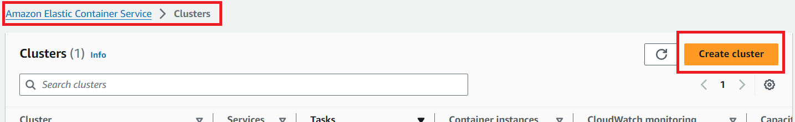
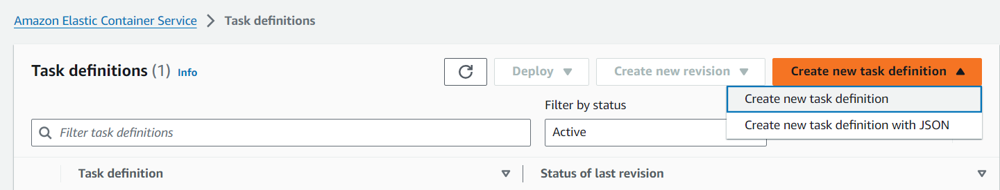
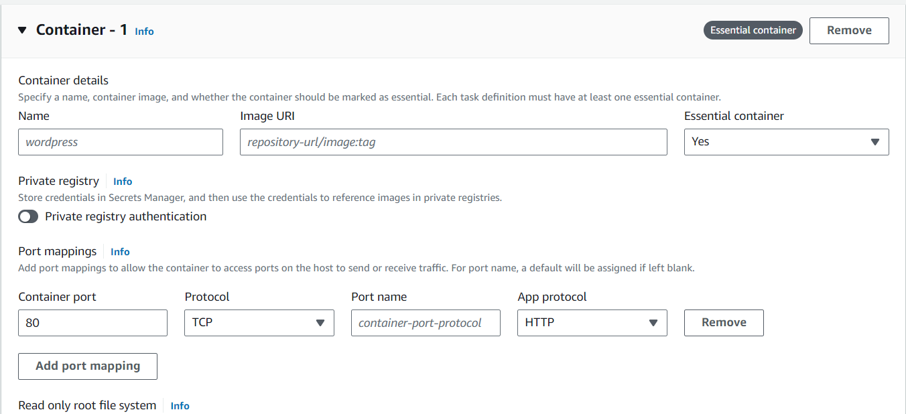
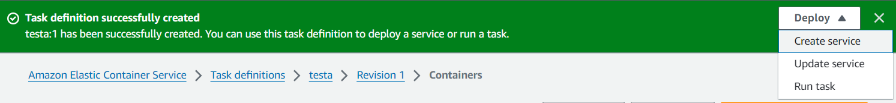
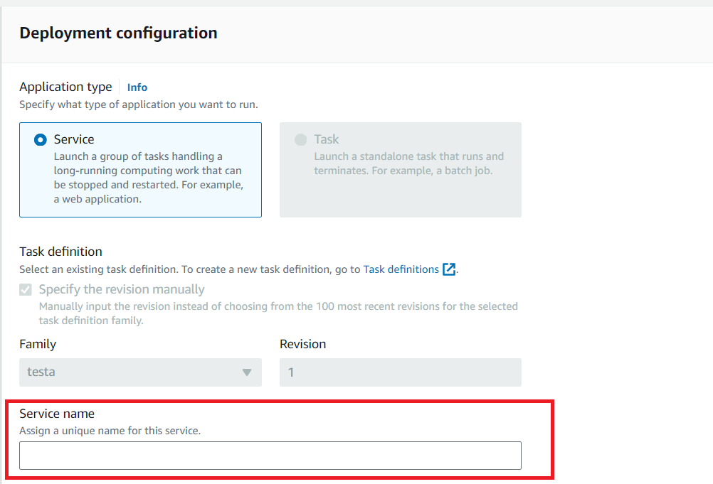
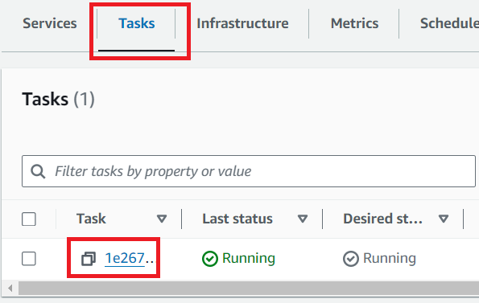

# Node.js Rest API with MongoDB Atlas

This is a sample project of a REST API with Node.js, Express and MongoDB Atlas

## Prerequisites
- Node.js
- NPM
- [MongoDB Atlas account](https://www.mongodb.com/cloud/atlas/register "MongoDB Atlas Sign up")

## Installation
- Install dependencies
```bash
npm install
```
- Create local environment file
```shell
cp .env.example .env
nano .env
```
- Provide MongoDB Atlas credentials
```
DB_USER:{username}
DB_PASS:{password}
DB_HOST:{host}
```
- Start Application locally
```bash
npm start
```
The application will be launched by [Nodemon](https://nodemon.com) so it will be restarted automatically on any file changes.


## Testing
- Import postman collection [MongoDBPlayground](https://github.com/tariqkhan051/freestyle-playground/blob/main/mongodb-atlas-crud/MongoDbPlayground.postman_collection.json)
- Run collection

## Deployment

<details>
<summary>Create a Docker Image and Push to Docker Hub</summary>

- [Create a Docker Hub Account](https://hub.docker.com/signup "DockerHub Sign Up")
  
- [Create a Public Repository](https://hub.docker.com/repository/create?namespace=)
  
- Build Docker Image
```
docker build -t mongodb-atlas-crud .
```
- Sign in to Docker Hub
```
docker login
```
- Tag the Docker Image
```
docker tag mongodb-atlas-crud:latest {docker_hub_username}/{public_repository_name}:latest
```
- Push the image to Docker Hub
```
docker push {docker_hub_username}/{public_repository_name}:latest
```
</details>

<details><summary>Setup AWS</summary>

- [Create AWS account](https://portal.aws.amazon.com/billing/signup#/start/email "AWS Sign Up")

- Create Elastic Container Service (ECS) Cluster
  - Search "ECS"
  - Click on **Elastic Container Service**
  - Click on **Create Cluster**
    
  - Click on **Tasks definitions** in left side bar
  - Create new task definition (_A task definition is a blueprint that describes how to run a containerized application_)
    
  - Under **Task definition configuration** Give your task definition a name
  - Under **Infrastructure requirements** select **AWS Fargate** as the launch type
  - Make sure **Container - 1** is already added, if not then click on **Add container** button to add a container to the task
  - Provide _Container Name_, _Image URI_ (of Docker image) and _Container port_
    
  - Click **Create** button to create the task definition
  
- Create a Service (_Service is a long-running task that represents a set of identical tasks that are run on your cluster_)
  - Once the task is created, click on **Deploy>_Create Service_**
    
  - Under **Environment**, Select the _Existing cluster_
  - Under **Deployment Configuration**, provide a _Service name_
    
  - Click on **Create** button and wait for the deployment to be completed

- Accessing the public API
  - Go to **Clusters**
  - Click on the cluster name you created
  - Go to **Tasks** tab and click on the task name
    
  - Under **Configuration** copy Public IP (_Example: 1.2.3.4_)
   
- Verify the public API access
  - Update _baseUrl_ in Postman collection to 
  ...```http://{{PUBLIC_IP}}:{{CONTAINER_PORT}}/```
  - Run Postman Collection
</details>

## Support Me 🫶
If this project helped you, please ⭐ this repo!

## Contribute 🙌
If you want to contribute, create a branch and submit the pull request!