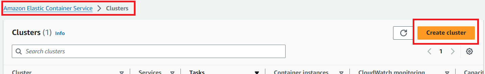
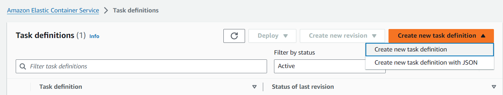
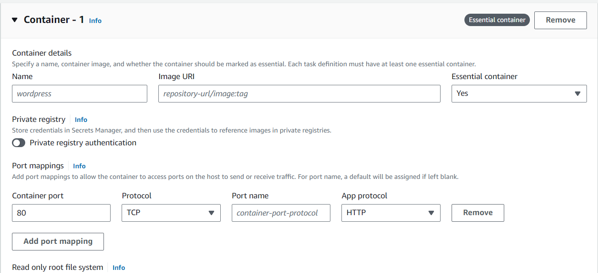
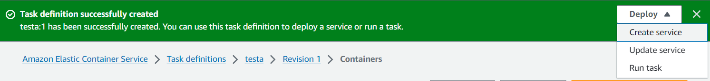
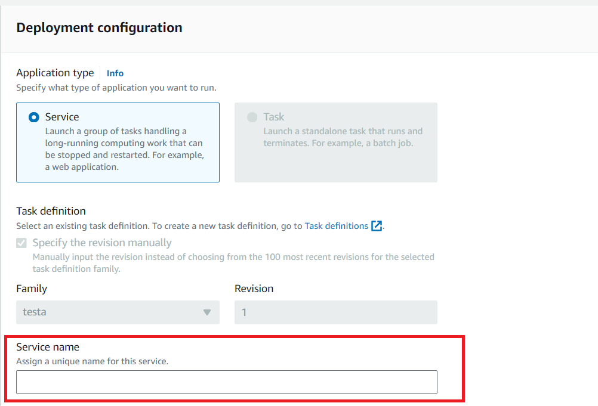
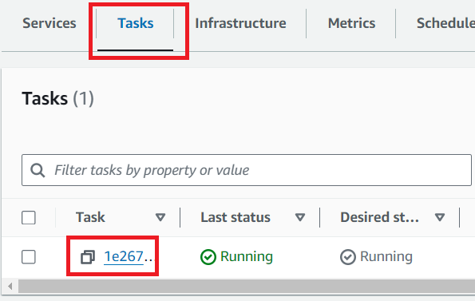

# Node.js Rest API with MongoDB Atlas

This is a sample project of a REST API with Node.js, Express and MongoDB Atlas

## Prerequisites
- Node.js
- NPM
- [MongoDB Atlas account](https://www.mongodb.com/cloud/atlas/register)

## Installation
- Install dependencies
```bash
npm install
```
- Create local environment file
```shell
cp .env.example .env
nano .env
```
- Provide MongoDB credentials
- Start Application
```bash
npm start
```
The application will be launched by [Nodemon](https://nodemon.com) so it will be restarted automatically on any file changes.


## Testing
- Import postman collection [MongoDBPlayground](https://github.com/tariqkhan051/freestyle-playground/blob/main/mongodb-atlas-crud/MongoDbPlayground.postman_collection.json)
- Run collection

## Deployment

### Create a Docker Image and Push to Docker Hub

- [Create a Docker Hub Account](https://hub.docker.com/signup)

- [Create a Public Repository](https://hub.docker.com/repository/create?namespace=)

- Build Docker Image
```
docker build -t mongodb-atlas-crud .
```
- Sign in to Docker Hub
```
docker login
```
- Tag the Docker Image
```
docker tag mongodb-atlas-crud:latest {docker_hub_username}/{public_repository_name}:latest
```
- push the image to Docker Hub
```
docker push {docker_hub_username}/{public_repository_name}:latest
```

### Setup AWS

- [Create AWS account](https://portal.aws.amazon.com/billing/signup#/start/email)

- Create Elastic Container Service (ECS) Cluster
Search "ECS"
Click on Elastic Container Service
Click on Create Cluster

Click on "Tasks definitions" in left side bar
Create new task definition (A task definition is a blueprint that describes how to run a containerized application)

Under "Task definition configuration" Give your task definition a name
Under "Infrastructure requirements" select “AWS Fargate” as the launch type.
Make sure Container - 1 is already added, if not then click on “Add container” button to add a container to the task.
Provide Container Name, Image URI (of Docker image) and Container port

Click "Create" button to create the task definition.

- Create a Service (service is a long-running task that represents a set of identical tasks that are run on your cluster)
Once the task is created, click on Deploy>Create a Service

Under Environment, Select the Existing cluster
Under Deployment Configuration, provide a Service name

Click on "Create" button and wait for the deployment to be completed


- Accessing the API
Go to Clusters
Click on the cluster you created
Go to "Tasks" tab and click on the task

Under "Configuration" 
copy "Public IP"


- Verify the public access
Go to Postman collection
Change base URL to 
```
http://{{PUBLIC_IP}}:{{CONTAINER_PORT}}/
```
Run Collection

Congratulations!

# Support Me
If this helped you, please star this repo!

# Contribute
If you want to contribute, create a branch and submit the pull request!